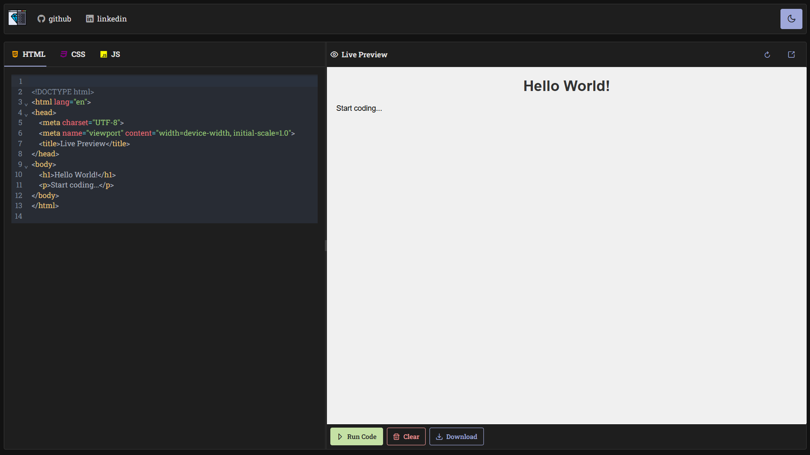

# Code editor

## Libraries used
| Icon | Technology | Category |
|------|------------|----------|
|  | [Vite](https://vite.dev/) | **Build tool** |
|  | [React](https://react.dev/) | **UI building** |
|  | [primeflex](https://primeflex.org/) | **CSS frameWork** |
|  | [Primereact](https://primereact.org) | **Component library** |
|  | [Axios](https://axios-http.com/) | **API request** |

